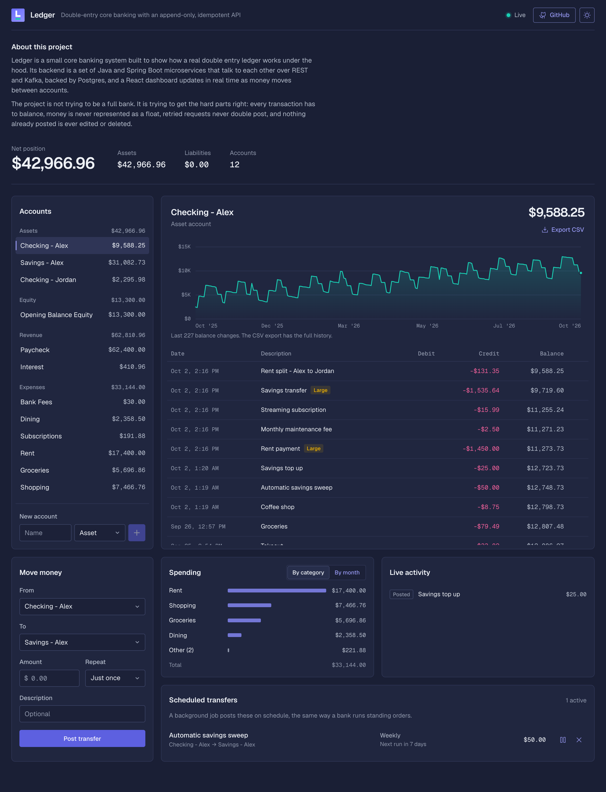

# Ledger

Ledger is a small core banking system built to show how a real double
entry ledger works under the hood. Its backend is a set of Java and Spring
Boot microservices that talk to each other over REST and Kafka, backed by
Postgres, and a React dashboard updates in real time as money moves
between accounts. The project is not trying to be a full bank. It is
trying to get the hard parts right: every transaction has to balance,
money is never represented as a float, retried requests never double
post, and nothing already posted is ever edited or deleted.

**[Try the live demo](https://amishpr-ledger.netlify.app/).** The whole
backend runs in your browser, so there is nothing to install and no account
to make.



## What this project actually does

You can create accounts (checking, savings, equity, revenue, expense), move
money between them with a transfer form, watch balances update live in a
second browser tab without refreshing, look at a running statement for any
account, and reverse a past transaction to see how a correction is handled
without touching the original record. You can also schedule a transfer to
repeat on its own, download an account's statement as a CSV file, and see
a chart of where money has been going by category and by month.

Under the hood, every money movement, whether typed into the transfer form
or posted automatically by the scheduler, goes through one service and one
database transaction that checks the accounting math before anything is
written. Everything that happens afterwards (the spending chart updating,
the other browser tab refreshing, the scheduler learning about a new
account) happens because that service published an event to Kafka.

## Architecture

```
Browser (React dashboard)
   |  REST /api/v1/**                        WebSocket /ws
   v
api-gateway :4000   (Spring Cloud Gateway: routing, CORS, rate limit, JWT, Swagger UI)
   |-- /api/v1/accounts, /transactions  ->  ledger-service :8081               -> Postgres "ledger"
   |-- /api/v1/recurring-transfers      ->  recurring-transfer-service :8082   -> Postgres "recurring"
   |-- /api/v1/insights                 ->  insights-service :8083             -> Postgres "insights"
   '-- /ws                              ->  notification-service :8084         (sockets only)

Kafka topics
   ledger.accounts.v1        account.created                    ledger -> recurring (account replica)
   ledger.transactions.v1    transaction.posted / .reversed     ledger -> insights, notifications
   recurring.transfers.v1    recurring-transfer.executed / ...  recurring -> notifications
```

| Service | What it owns |
| --- | --- |
| `ledger-service` | Accounts, double entry transactions, reversals, statements, CSV export, the audit log. The only thing that writes money |
| `recurring-transfer-service` | Scheduled transfers and the background sweep that posts them through the ledger's API, guarded by a distributed lock |
| `insights-service` | A read model of spending, built only from ledger events and rebuildable by replaying them |
| `notification-service` | Open dashboard WebSockets. Turns events into live updates |
| `api-gateway` | The one public address: routing, CORS, rate limiting, security headers, optional JWT, one Swagger UI for everything |

Services call each other over REST when one needs an answer (the scheduler
asking the ledger to post a transfer) and publish to Kafka when something
has already happened (a transaction was posted). Events leave each service
through a transactional outbox, so a change and its event can never
disagree. The reasoning behind each of these choices is in
[docs/adr](docs/adr/README.md), and the full story is in
[WALKTHROUGH.md](WALKTHROUGH.md).

## Features

**Accounting**

- Double entry accounting enforced on every transaction, not just assumed
- All money stored and transmitted as whole cents, never a float. Amounts
  travel as strings so JavaScript never has to hold one as a number
- Idempotent posting with an `Idempotency-Key` header, safe even when two
  identical requests arrive at the same instant
- Overdraft protection on asset accounts, safe under concurrent requests
  through row locks taken in a fixed order
- Reversals instead of edits or deletes, with database triggers that refuse
  to change a posted entry no matter which code path tries
- Statements with running balances computed by a SQL window function
- An audit log written in the same transaction as each change

**Distributed system**

- Five Spring Boot services, each with its own Postgres database
- Kafka events through a transactional outbox, with idempotent consumers,
  retries with backoff, and dead letter topics
- Recurring transfers swept by one instance at a time (ShedLock), posted with
  derived idempotency keys so a retry can never double post, and kept due
  rather than skipped when the ledger is temporarily unreachable
- A Resilience4j circuit breaker and retry on the one synchronous call
  between services
- An account replica in the scheduler fed by events, so it keeps working
  while the ledger is down
- A spending read model (CQRS) built purely from events

**API and operations**

- Versioned REST API under `/api/v1`, documented with OpenAPI and browsable
  in one Swagger UI at the gateway
- RFC 9457 Problem Details errors with stable codes and trace ids
- Write rate limiting, CORS, security headers, and optional JWT scopes at
  the gateway
- Health, liveness and readiness probes, Prometheus metrics, OpenTelemetry
  traces that follow a request through Kafka, structured JSON logs
- Docker images built in layers, a Docker Compose stack with Jaeger,
  Prometheus and Grafana, Kubernetes manifests, and a CI pipeline that tests,
  builds and scans every image

**Dashboard**

- Live updates over WebSockets, including transfers the scheduler posts
- An interactive balance history chart per account, built as plain SVG
- A spending breakdown by category and by month
- CSV export of any account's full statement
- A demo build that runs a copy of the backend inside the browser, so the
  dashboard can be hosted on a free static host

## Tech stack

**Backend:** Java 21, Spring Boot 4.1, Spring Cloud Gateway (2025.1),
Spring Data JPA and Hibernate, `JdbcClient`, Flyway, Postgres 17, Apache
Kafka (KRaft) with Spring Kafka, Resilience4j, ShedLock, springdoc-openapi,
Micrometer and OpenTelemetry, Maven.

**Testing:** JUnit 6, AssertJ, Mockito, MockMvc, WebTestClient, ArchUnit,
an embedded Postgres and an embedded Kafka broker, so the whole suite runs
with nothing installed but a JDK. Playwright for end to end checks.

**Infrastructure:** Docker, Docker Compose, Kubernetes with Kustomize,
GitHub Actions, Jaeger, Prometheus, Grafana.

**Frontend:** React, TypeScript, and Vite, styled with plain CSS. No UI
component library and no state management library, since the app is small
enough that a few React hooks are enough.

## Project structure

```
ledger-bank-system/
├─ services/                         Spring Boot backend (Maven multi-module, ./mvnw included)
│  ├─ event-contracts/               Versioned Kafka event records shared by every service
│  ├─ platform/                      Shared auto-configuration: Problem Details, outbox, Kafka retries, cents type
│  ├─ ledger-service/                Accounts, transactions, statements, audit log, demo seed
│  ├─ recurring-transfer-service/    Schedules, the sweep, the ledger client, the account replica
│  ├─ insights-service/              Spending read model built from events
│  ├─ notification-service/          Kafka to WebSocket fan-out
│  ├─ api-gateway/                   Spring Cloud Gateway
│  ├─ test-support/                  Embedded Postgres and Kafka helpers for tests
│  ├─ dev-infra/                     Postgres and Kafka in one JVM, for machines without Docker
│  └─ Dockerfile                     One layered image build for every service
├─ web/                              React dashboard
│  ├─ src/
│  │  ├─ components/                 Accounts panel, transfer form, statement, recurring transfers, charts, feed
│  │  ├─ api/                        The LedgerApi interface, the HTTP client, and shared types
│  │  ├─ demo/                       In-browser backend used by the hosted demo build, and its tests
│  │  └─ useLedgerSocket.ts          WebSocket hook with reconnect
│  ├─ public/                        Favicon, app icons, web manifest, link preview card
│  └─ Dockerfile                     The dashboard as static files behind nginx
├─ deploy/
│  ├─ k8s/base/                      Kustomize manifests
│  ├─ observability/                 Prometheus scrape config, Grafana datasource and dashboard
│  └─ postgres/init.sql              Creates one database per service
├─ docs/adr/                         Architecture decision records
├─ scripts/wait-for.mjs              Lets `npm run dev` start services once Postgres and Kafka are up
├─ docker-compose.yml                The whole stack, plus optional observability and tools
└─ package.json                      Root scripts that run everything together
```

## How the data model works

Each service owns its tables. The ledger's are the interesting ones.

**account** has a name, a type (asset, liability, equity, revenue, or
expense), and a currency. The type matters because it decides which
direction increases the account's balance. This is standard double entry
accounting: a debit increases an asset or expense account and decreases a
liability, equity, or revenue account, while a credit does the opposite.

**ledger_transaction** is the record of something happening, like a
transfer or a fee. It has a description, a status of posted or voided, an
optional idempotency key with a fingerprint of the request that used it,
an optional origin (such as the recurring transfer that posted it), and,
for a reversal, the transaction it reverses.

**journal_entry** is one leg of a transaction. A transfer between two
accounts is always two entries: a debit on one account and a credit on the
other, for the same amount. A transaction can have more than two entries if
it touches more than two accounts, as long as the debits and credits still
add up. Entries carry a journal sequence number that orders entries written
in the same instant, and a trigger makes them append-only.

**audit_log** records every account creation and every transaction posted
or reversed, written in the same database transaction as the change.

**outbox_event** holds events waiting to be published to Kafka.

Balances are never stored as a column anywhere. A balance is always the sum
of an account's entries, so there is exactly one source of truth for how
much money is in an account: its history.

The recurring transfer service keeps `recurring_transfer` (a standing
instruction: which accounts, how much, how often, when it is next due), an
`account_replica` fed by `account.created` events, a `shedlock` table, and
its own outbox. The insights service keeps `spending_by_category`,
`spending_by_month`, and `processed_event`, which is how it ignores an event
it has already applied.

## API reference

All amounts are sent and received as strings of whole cents, for example
`"1050"` for ten dollars and fifty cents. The base URL is the gateway,
`http://localhost:4000/api/v1`. The OpenAPI documents for every service are
browsable at **http://localhost:4000/swagger-ui.html**.

| Method | Path | Description |
|---|---|---|
| GET | `/accounts` | List every account with its current balance |
| POST | `/accounts` | Open an account. Body: `name`, `type`, optional `currency` |
| GET | `/accounts/{id}` | Get one account and its balance |
| GET | `/accounts/{id}/statement?limit=50` | Recent entries, newest first, each with the running balance after it. `limit` is 1 to 1000 |
| GET | `/accounts/{id}/statement/export` | The account's full statement as a CSV file, oldest first |
| POST | `/transactions` | Post a transaction. Header: `Idempotency-Key` (recommended). Body: `description`, `entries` (array of `accountId`, `direction`, `amountMinor`). Answers 201, or 200 with `Idempotent-Replayed: true` for a retry |
| GET | `/transactions/{id}` | Get one transaction and its entries |
| POST | `/transactions/{id}/reverse` | Reverse a posted transaction. Body: optional `note` |
| GET | `/recurring-transfers` | List every scheduled transfer |
| POST | `/recurring-transfers` | Schedule one. Body: `description`, `fromAccountId`, `toAccountId`, `amountMinor`, `interval` (`EVERY_MINUTE`, `DAILY`, `WEEKLY`, or `MONTHLY`), optional `startAt` |
| PATCH | `/recurring-transfers/{id}` | Pause or resume. Body: `{ "active": true }` |
| POST | `/recurring-transfers/{id}/toggle-active` | Flip between paused and running. Kept for the dashboard; prefer PATCH |
| DELETE | `/recurring-transfers/{id}` | Cancel it. Transfers it already posted are not undone |
| GET | `/insights/spending` | Total spending grouped by expense account and by month |

Errors are [RFC 9457](https://www.rfc-editor.org/rfc/rfc9457) Problem
Details (`application/problem+json`) with a stable `code` to switch on and a
`traceId` to find the request in Jaeger:

```json
{
  "status": 409,
  "title": "Conflict",
  "detail": "Account 0190c3a2-... has insufficient funds",
  "instance": "/api/v1/transactions",
  "code": "INSUFFICIENT_FUNDS",
  "traceId": "72e3a8b98a8c7d1ac07ca098a0c4488e"
}
```

Codes include `VALIDATION_ERROR` (with a `violations` list),
`UNBALANCED_TRANSACTION`, `INSUFFICIENT_FUNDS`, `IDEMPOTENCY_CONFLICT`,
`CURRENCY_MISMATCH`, `ACCOUNT_NOT_FOUND`, `ALREADY_VOIDED`,
`INVALID_RECURRING_TRANSFER`, `LEDGER_UNAVAILABLE`, `RATE_LIMITED`,
`UPSTREAM_UNAVAILABLE` and `UPSTREAM_TIMEOUT`.

A WebSocket at `ws://localhost:4000/ws` sends a message whenever a
transaction is posted or reversed, or the scheduler runs or fails a
transfer, which is what lets the dashboard update without polling.

## Running it

You need a JDK 21 or newer and Node.js 20 or newer. Maven does not need
installing; the wrapper in `services/` downloads it. Docker is optional.

Install the JavaScript dependencies once:

```bash
npm install
npm install --prefix web
```

### With Docker

```bash
docker compose up --build
```

That builds and starts Postgres, Kafka, all five services, the dashboard
and Jaeger. Then:

| What | Where |
| --- | --- |
| Dashboard | http://localhost:5173 |
| API and Swagger UI | http://localhost:4000/swagger-ui.html |
| Traces (Jaeger) | http://localhost:16686 |

Add `--profile observability` for Prometheus (http://localhost:9090) and a
provisioned Grafana dashboard (http://localhost:3000), and `--profile
tools` for Kafka UI (http://localhost:8090).

### Without Docker

```bash
npm run dev
```

This builds the services, then starts `dev-infra` (a real Postgres and a
real Kafka broker running inside one JVM, on the same ports Docker Compose
uses), the five services, and the Vite dev server, with labeled output for
each. Open http://localhost:5173. The first start takes a minute or two
while everything warms up.

Either way, the ledger seeds itself on first start with a year of activity
for two fictional people: biweekly paychecks, weekly groceries, monthly rent
and subscriptions, dining out, a few large purchases, a monthly transfer to
savings, and one reversal. It uses a seeded random number generator, so
every run produces the same year, the same one the hosted demo shows. The
recurring transfer service waits for those accounts to arrive as events and
schedules a weekly savings sweep that is already due, so you can watch the
background job post its first transfer within its first sweep.

Local data lives in `.dev-data/` and survives restarts. To start over,
stop everything and run `npm run infra:clean` once, or `docker compose down
-v` for the Docker stack.

If you use VS Code, `.vscode/launch.json` has a debug configuration for
each service and a compound that starts all of them plus Chrome, and
`.vscode/tasks.json` has tasks for testing and building.

## Demo mode, and hosting this for free

The backend is five JVMs, Postgres and Kafka, so a static host like Netlify
or GitHub Pages cannot run it. Rather than leave the project as something
you have to clone and start locally before you can see anything, the
frontend can run against a second backend that lives entirely in the
browser.

Every component talks to a `LedgerApi` interface rather than to `fetch`
directly, and there are two implementations of it. One is the HTTP client
that calls the API gateway. The other, in `web/src/demo`, is a port of the
ledger's rules that keeps its tables in memory: the same balance check, the
same overdraft protection, the same idempotency keys, the same reversals,
the same calendar math, and the same recurring transfer sweep running on a
15 second interval inside the tab. It seeds itself on load with the same
year of activity the real seed generates, using the same seeded random
number generator, so the hosted demo and a local checkout show the same
data.

Run it locally with:

```bash
npm run dev:demo
```

No services need to be running. The dashboard shows a banner explaining
that it is in demo mode, and a reset button that reloads and regenerates
the data. Everything written in demo mode lives in memory only and is gone
on reload.

There are two ways to deploy it, and both are set up already.

**Netlify.** Point Netlify at the repository and let it read the included
`netlify.toml`, which sets the base directory to `web`, publishes
`web/dist`, and sets `VITE_DEMO=true` for the build. No other configuration
is needed.

**GitHub Pages.** The workflow in `.github/workflows/deploy-demo.yml`
lints, tests, and builds the demo on every push to `main`, then publishes
it. It needs one setting changed in the repository first: go to Settings,
then Pages, and set Source to "GitHub Actions". Without that the workflow
runs but cannot publish. The site then appears at
`https://<your-username>.github.io/<repository-name>/`.

Pages serves a project site from a subdirectory rather than the domain
root, so the built asset URLs need that prefix or every file 404s. The
workflow reads the correct prefix from the `configure-pages` action and
passes it as `VITE_BASE`, and `web/vite.config.ts` turns that into Vite's
`base`. It resolves to `/` when unset, which is what Netlify and local
development use, so the same build command works for all three.

What the demo does not cover: there is no shared state between visitors,
since each browser gets its own copy of the data, and it is not a
deployment of the real services. For that, see "Deploying" below.

## Search engines and link previews

The dashboard is a single client rendered page, which is the awkward case
for both Google and for the thing that generates a preview card when you
paste a link into iMessage, Discord, or Slack. None of those run the app;
they read `web/index.html` and nothing else. So everything they need is in
that file as static markup, not rendered by React.

**The preview card.** `web/index.html` carries a full set of Open Graph and
Twitter Card tags, including an absolute `https://` URL for the image.
Absolute matters: a root relative path is the single most common reason a
pasted link shows up as bare text with no picture, because the scraper has
no page context to resolve it against. The card itself is
`web/public/og-image.png`, at the 1200x630 that every one of those clients
expects, and it is regenerated by `docs/make-social-assets.py` from the
dashboard screenshot and the app's own colors rather than drawn by hand,
so it cannot quietly drift out of date. That script also produces the
`apple-touch-icon.png` and the two PWA icons from the same source as
`favicon.svg`.

Chat clients cache a preview hard and for a long time. If you change the
card, the old one will keep appearing until the cache expires, so test with
a URL you have not pasted anywhere yet.

**Being indexed once, not twice.** The same build is published to both
Netlify and GitHub Pages, and two identical copies of a page compete with
each other in search results instead of adding up. `web/index.html` sets an
absolute canonical tag pointing at the Netlify URL, so both copies name the
same page as the real one. On top of that, the `seo()` plugin in
`web/vite.config.ts` writes a `noindex` tag into every build that is not
the production Netlify deploy, which it recognizes by checking Netlify's
`CONTEXT` and `URL` build variables. Deploy previews, branch deploys, the
Pages build and any local build all get it; only the real site does not.

That plugin also emits `robots.txt`, and a one URL `sitemap.xml` for the
indexable build. Note that the `noindex` tag, not `robots.txt`, is what
actually keeps the Pages copy out of Google: a `robots.txt` is only read
from the root of a domain, and Pages serves this project from a
subdirectory, so the file lands somewhere no crawler will look.

The catch all redirect in `netlify.toml` answers every path with the app
and a 200, which for a crawler is an unlimited supply of near duplicate
URLs. The canonical tag is what folds them all back into one page. The same
file sets a one year immutable cache on Vite's fingerprinted assets, since
page speed is a ranking signal and those filenames change whenever their
contents do.

## Running the tests

```bash
npm test
```

This runs both suites. `npm run test:services` (or `./mvnw verify` in
`services/`) runs about 150 backend tests: unit tests, MockMvc and
WebTestClient slice tests, integration tests against a real Postgres and a
real Kafka broker started inside the test JVM, and ArchUnit architecture
rules. Nothing needs installing but a JDK, which is why it runs the same way
on a laptop and in CI. Coverage reports land in each module's
`target/site/jacoco/`.

The integration tests include every case from the original Node test
suite: a transaction that does not balance is rejected, an overdraft is
rejected without changing the balance, a retried request with the same
idempotency key returns the original result, reusing a key with a different
payload is a conflict, and a reversal restores the prior balance and voids
the original. On top of those: twenty concurrent withdrawals that must leave
exactly zero, eight simultaneous requests with one key that must post
exactly once, triggers that must refuse to edit history, events that must
reach Kafka, a poison message that must land in a dead letter topic, two
sweeps at once where only one may run, and the gateway's routing, rate
limiting and JWT scopes.

The frontend suite runs the same core cases against the in-browser demo
backend, so the two implementations cannot quietly drift apart on the
rules that matter. It also checks that the generated year of demo data
never takes the main checking account negative.

## Deploying

**Images.** `services/Dockerfile` builds any service:

```bash
docker build --build-arg SERVICE=ledger-service -t ledger/ledger-service services
```

It builds only that module and its dependencies, splits the jar into
Spring Boot's layers so a code change rebuilds a few kilobytes instead of
the dependency layer, and runs on a JRE as a non-root user with a heap sized
from the container's memory limit. `web/Dockerfile` builds the dashboard
into an nginx image.

**Kubernetes.** `deploy/k8s/base` is a Kustomize base:
`kubectl apply -k deploy/k8s/base`. Each service gets a Deployment and a
Service with startup, liveness and readiness probes on the Actuator health
groups, resource requests and limits, a restricted security context
(non-root, read-only root filesystem, no capabilities), and a pre-stop delay
for graceful shutdown. The ledger and gateway autoscale on CPU, the ledger
has a disruption budget, and only the gateway is exposed through an Ingress.
Postgres and Kafka are expected to be managed services such as Amazon RDS
and MSK; point `deploy/k8s/base/configmap.yaml` at them and create the
`ledger-db` secret described in `secret.example.yaml`.

**CI.** `.github/workflows/backend-ci.yml` runs `./mvnw verify` on every
change under `services/`, keeps the test and coverage reports, then builds
every service's image and scans it with Trivy. Dependabot keeps Maven, npm,
Docker and Actions dependencies current.

## Configuration

Every setting has a default that works locally and can be overridden with
an environment variable.

| Variable | Default | Used by | Purpose |
|---|---|---|---|
| `LEDGER_DB_URL`, `RECURRING_DB_URL`, `INSIGHTS_DB_URL` | `jdbc:postgresql://localhost:5432/<service>` | each service | Its own database |
| `*_DB_USER`, `*_DB_PASSWORD` | `ledger` / `ledger` | each service | Database credentials |
| `KAFKA_BOOTSTRAP_SERVERS` | `localhost:9092` | all but the gateway | Kafka |
| `LEDGER_SEED_ENABLED` | `false` | ledger | Seed a year of demo data into an empty ledger |
| `RECURRING_SEED_ENABLED` | `false` | recurring | Schedule the demo savings sweep |
| `SCHEDULER_INTERVAL` | `PT15S` | recurring | How often the sweep looks for due transfers |
| `LEDGER_SERVICE_URL` | `http://localhost:8081` | recurring, gateway | Where the ledger is |
| `RECURRING_SERVICE_URL`, `INSIGHTS_SERVICE_URL` | `http://localhost:8082`, `:8083` | gateway | Upstreams |
| `NOTIFICATION_SERVICE_WS_URL` | `ws://localhost:8084` | gateway | WebSocket upstream |
| `CORS_ORIGIN` | `http://localhost:5173` | gateway | The dashboard's origin |
| `GATEWAY_JWT_ENABLED` | `false` | gateway | Require a bearer token. Set `SPRING_SECURITY_OAUTH2_RESOURCESERVER_JWT_ISSUER_URI` too |
| `NOTIFICATION_ALLOWED_ORIGINS` | `http://localhost:*` | notification | Origins allowed to open the socket |
| `PUBLIC_API_URL` | `http://localhost:4000` | all | Server URL shown in the OpenAPI documents |
| `MANAGEMENT_OPENTELEMETRY_TRACING_EXPORT_OTLP_ENDPOINT` | unset | all | Where to send traces. Unset means none are exported |
| `PORT` | 4000, 8081 to 8084 | all | Listening port |

**web/.env**

| Variable | Default | Purpose |
|---|---|---|
| `VITE_API_URL` | `http://localhost:4000/api/v1` | Base URL the dashboard uses for REST calls |
| `VITE_WS_URL` | `ws://localhost:4000/ws` | URL the dashboard connects to for live updates |
| `VITE_DEMO` | unset | Set to `true` to run the in-browser backend instead of calling the API. `netlify.toml` and the GitHub Pages workflow set this for the hosted builds |
| `VITE_BASE` | unset | Path prefix the site is served from, needed only on GitHub Pages, where it is `/<repository-name>`. Unset means the domain root |

## What is intentionally left out

There is no login. The gateway can require JWTs with read and write scopes
when an identity provider is configured, but the dashboard has no users, and
accounts owned by specific people would not change how the accounting
works.

There is no support for a single transaction spanning multiple currencies.
Every entry in a transaction has to share one currency. Real currency
conversion needs its own pair of entries against an FX account and its own
set of rules, which felt like a separate project rather than an extension of
this one.

Balances are sums over an indexed table rather than a stored column. That
is fast at this scale. A production ledger would keep a balance per account
updated in the posting transaction, with the sums kept as a reconciliation
check.

Event schemas are versioned Java records with written compatibility rules,
not Avro in a schema registry, and there is no service discovery server
because Kubernetes already provides DNS. The reasoning for each is in
[docs/adr](docs/adr/README.md).

## Further reading

- [WALKTHROUGH.md](WALKTHROUGH.md): how everything works and why, written
  to be explained out loud
- [docs/adr](docs/adr/README.md): the main architecture decisions
